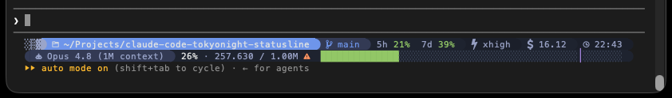

# Claude Code · Tokyo Night Powerline Statusline

A custom `statusLine` for [Anthropic's Claude Code CLI](https://code.claude.com/) that renders a two-line **Tokyo Night** powerline status bar at the bottom of your terminal. Pure Python 3 standard library — **zero dependencies, nothing to `pip install`** — and cross-platform across **Linux, macOS, and Windows**.

> **Why this exists:** most Claude Code statuslines hardcode a 200k context window and break (or lie) on the 1M-token long-context models. This one is **model-aware** — it reads the real limit straight from Claude Code — and it surfaces your **rate-limit usage** for Pro/Max accounts. The colors, the compaction marker, and the full-width gauge all follow the *actual* context window you're running.

---

## Preview



<details>
<summary>Text representation</summary>

```text
░▒▓   ~/Projects/myapp    main  ●2 ↑1    5h 18%  7d 34%   xhigh   $1.24   22:07  󰈷 f00dface
  󰚩 Opus 4.8  42% · 84.231 / 200k  ████████████████████████░░░░░░░░│░░░░░░░░░░░░░░░░░░░░░░░░░░░░░
```

</details>

---

## Features

| Feature | What it does |
| --- | --- |
| **Two-line layout** | **Line 1** = workspace + info chips (path, git, rate limits, effort, cost, clock, session, last prompt). **Line 2** = model name + a **full-width** context gauge that spans the terminal. |
| **Model-aware context window** | Auto-detects the real limit from `context_window.context_window_size` (200,000 or 1,000,000). **No hardcoded 200k.** |
| **Raw token count** | Shows percent **and** the raw token count with thousands separators, e.g. `84.231 / 200k`. |
| **Compaction marker** | A magenta marker (`│`) sits on the gauge at the auto-compact point (~78% on the 200k window, ~85% / ~850k on the 1M window). |
| **Compaction-relative colors** | Gauge is **green** (safe) → **orange** (within ~10% of the limit, below the compaction point) → **red** (at/past the compaction point). |
| **1M pricing-tier warning** | A warning glyph () appears **only on the 1M model once you cross 200k tokens** — it signals the higher long-context **pricing** tier, *not* a context-fullness warning. |
| **Rate-limit chips** | `5h` and `7d` usage chips, colored by utilization. Only shown for Pro/Max accounts that expose them. |
| **Robust full-width gauge** | Terminal width detection via `COLUMNS` env → `/dev/tty` ioctl → `os.get_terminal_size` → fallback, with **display-width-aware sizing** (wide Nerd Font glyphs count as 2 cells) so the bar fills the width without overflowing or truncating. |
| **Graceful degradation** | Segments hide automatically when their data is absent (no git outside a repo, no rate limits on non-Max). Errors degrade gracefully — it **never crashes**. |
| **Local & free** | Runs entirely locally and consumes **no API tokens**. |

---

## Requirements

- **Python 3.8+** — invoked as `python3` on Linux/macOS, `python` on Windows.
- **A [Nerd Font](https://www.nerdfonts.com/)**, *installed **and** selected as your terminal font.* The icons and powerline separators are Nerd Font glyphs. **Without a Nerd Font, they render as missing-glyph boxes ("tofu").**
  - Recommended: **MesloLGS NF**. Also works great with **FiraCode Nerd Font** or **JetBrainsMono Nerd Font**.
  - Download: <https://www.nerdfonts.com/font-downloads>
- **A truecolor-capable terminal** (24-bit color — most modern terminals qualify). On Windows, use **Windows Terminal**, *not* the legacy `cmd.exe`.
- **Claude Code v2.1.132+** for the native context fields. Live width-on-resize tracking needs **v2.1.153+** (which provides `COLUMNS`).

---

## Installation

The default install path is `~/.claude/scripts/statusline.py` (Windows: `%USERPROFILE%\.claude\scripts\statusline.py`).

### macOS / Linux

1. Download the script and make it executable:

   ```bash
   mkdir -p ~/.claude/scripts \
     && curl -fsSL https://raw.githubusercontent.com/NeverGET/claude-code-tokyonight-statusline/main/statusline.py -o ~/.claude/scripts/statusline.py \
     && chmod +x ~/.claude/scripts/statusline.py
   ```

2. Add the `statusLine` block to `~/.claude/settings.json` (see [`examples/settings.json`](examples/settings.json)):

   ```json
   {
     "statusLine": {
       "type": "command",
       "command": "python3 ~/.claude/scripts/statusline.py",
       "padding": 0,
       "refreshInterval": 10
     }
   }
   ```

   > **Merging into an existing `settings.json`:** if you already have a `settings.json`, add **only** the `"statusLine"` key — don't overwrite the whole file.

### Windows (PowerShell)

1. Create the folder and download the script:

   ```powershell
   New-Item -ItemType Directory -Force "$env:USERPROFILE\.claude\scripts" | Out-Null
   Invoke-WebRequest -Uri "https://raw.githubusercontent.com/NeverGET/claude-code-tokyonight-statusline/main/statusline.py" -OutFile "$env:USERPROFILE\.claude\scripts\statusline.py"
   ```

2. Add the `statusLine` block to `%USERPROFILE%\.claude\settings.json` (see [`examples/settings.windows.json`](examples/settings.windows.json)):

   ```json
   {
     "statusLine": {
       "type": "command",
       "command": "python %USERPROFILE%\\.claude\\scripts\\statusline.py",
       "padding": 0,
       "refreshInterval": 10
     }
   }
   ```

   > **Notes:** Python must be on your `PATH` (the command invokes `python`, not `python3`). Use **Windows Terminal** — the legacy `cmd.exe` does not support truecolor. The path uses doubled backslashes (`\\`) because the value is JSON.

> The statusline appears on your **next interaction** with Claude Code. A restart may be needed to pick up `settings.json` changes. `refreshInterval` is in **seconds**.

---

## Configuration & Customization

It's a single, self-contained file — open `statusline.py` and edit. The interesting knobs:

| What to change | Where |
| --- | --- |
| **Colors** | The palette constants near the top (the Tokyo Night `LAV`, `BLUE`, `GREEN`, `RED`, etc. tuples). |
| **Icons** | The Nerd Font glyph constants block (`FOLDER`, `BRANCH`, `ROBOT`, `WARN`, …). |
| **Compaction thresholds** | `compaction_frac()` — controls where the magenta marker sits. |
| **Color bands** | `bar_color()` (gauge) and `gauge_color()` (rate-limit chips). |
| **Refresh / padding** | `refreshInterval` (clock tick / idle refresh, in **seconds**) and `padding` in `settings.json`. |

**Segments hide themselves.** There's nothing to toggle off for data you don't have — the git segment vanishes outside a repo, the rate-limit chips appear only when Claude Code reports them, and the cost/effort/session chips show only when present. Line 1 also drops trailing chips (and then the last-prompt tail) automatically if it would overflow the terminal width.

---

## What it reads

The script reads the **native Claude Code statusline JSON over stdin**. Fields it uses:

| Field | Used for |
| --- | --- |
| `model.display_name` | Model name on line 2 |
| `workspace.current_dir` | Path segment (falls back to `cwd`) |
| `context_window.context_window_size` | The **real** context limit (200k vs 1M) |
| `context_window.total_input_tokens` | Raw token count |
| `context_window.used_percentage` | Gauge fill % (computed from tokens if absent) |
| `exceeds_200k_tokens` | The 1M pricing-tier warning glyph |
| `rate_limits.five_hour.used_percentage` / `rate_limits.seven_day.used_percentage` | `5h` / `7d` chips |
| `cost.total_cost_usd` | `$` cost chip |
| `effort.level` | Effort chip |
| `session_id` | Session id chip (first 8 chars) |
| `transcript_path` | Dim last-prompt tail on line 1 |

Official statusline reference: <https://code.claude.com/docs/en/statusline>

---

## Troubleshooting

| Symptom | Fix |
| --- | --- |
| **Blank status line** | The script isn't executable (`chmod +x ~/.claude/scripts/statusline.py`) or the python path is wrong. Test with the mock command below. |
| **Boxes / "tofu" instead of icons** | No Nerd Font is selected as your terminal font. Install one and set it as the terminal's font. |
| **No colors / weird escape codes** | Terminal lacks truecolor support. On Windows, switch to **Windows Terminal**. |
| **Bar doesn't fill the full width, or shows `…`** | Claude Code older than **v2.1.153** doesn't provide `COLUMNS`. The script falls back to a detected width but won't track live resize — upgrade to track it. |
| **Want to see what width was detected** | Run with `SL_DEBUG=1` to print a diagnostic line showing the detected width and its source. |

### Test it with mock input

```bash
echo '{"model":{"display_name":"Opus"},"workspace":{"current_dir":"/tmp"},"context_window":{"context_window_size":1000000,"total_input_tokens":117564,"used_percentage":11.8}}' | SL_DEBUG=1 python3 ~/.claude/scripts/statusline.py
```

This pipes a sample payload through the script and prints the rendered statusline plus a `[debug]` line (`width=… via=… …`) so you can confirm width detection, glyph widths, and gauge sizing.

---

## Credits

- **Tokyo Night** color scheme — popularized by [folke/tokyonight.nvim](https://github.com/folke/tokyonight.nvim) and the Starship `tokyo-night` preset.
- **Nerd Fonts** — by [ryanoasis](https://github.com/ryanoasis/nerd-fonts).
- **Claude Code's `statusLine` feature** — by [Anthropic](https://code.claude.com/docs/en/statusline).

---

## License

[MIT](LICENSE) — see the `LICENSE` file.
